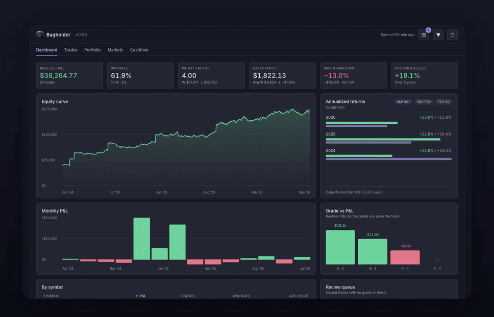
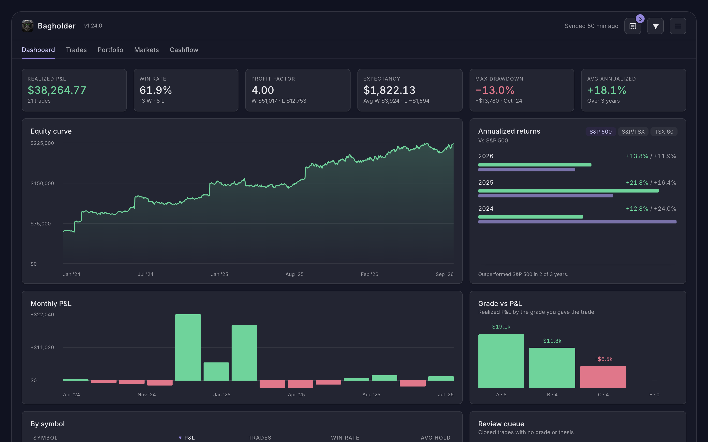
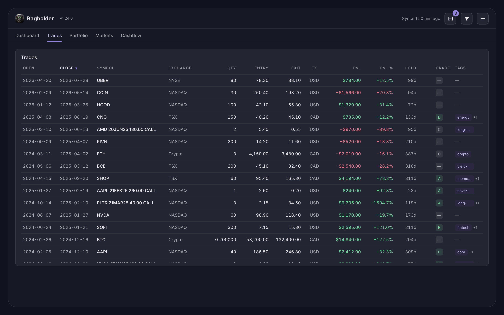
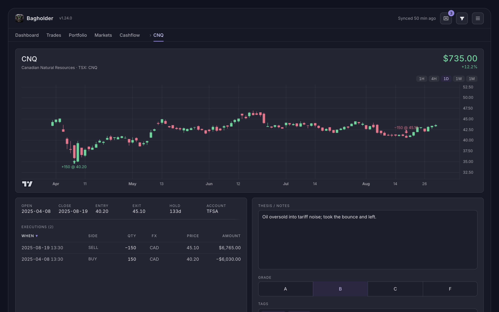
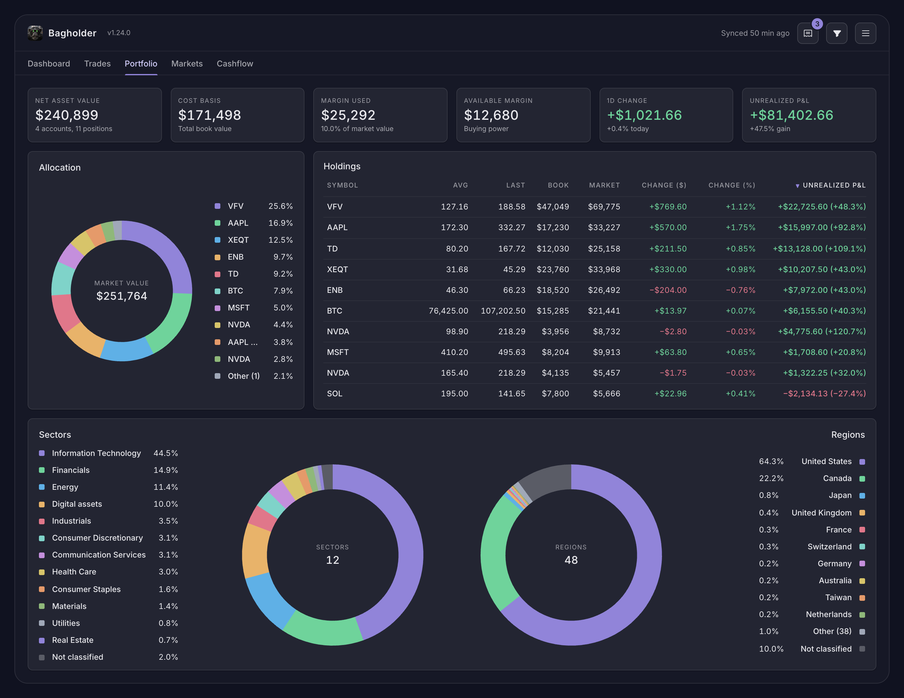
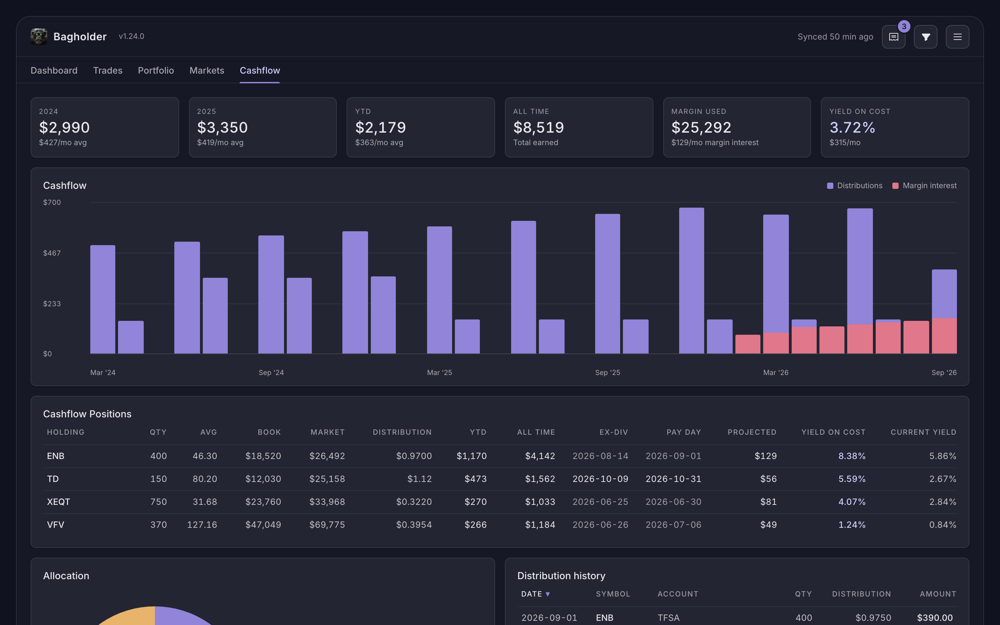
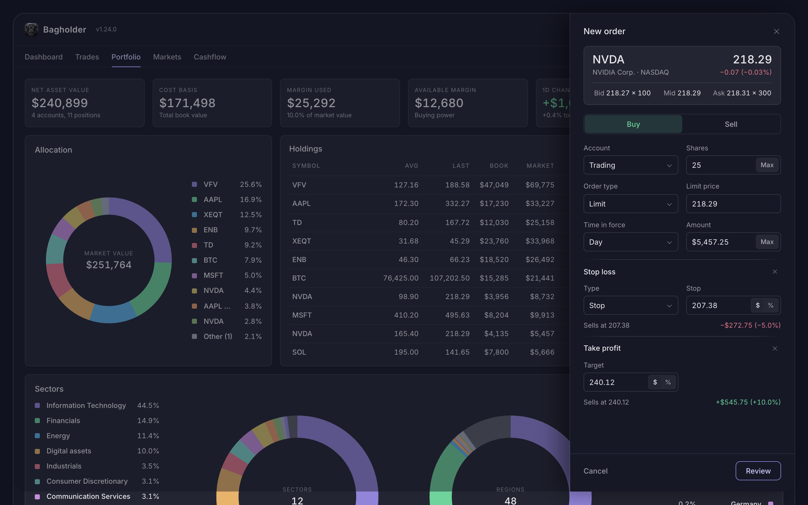
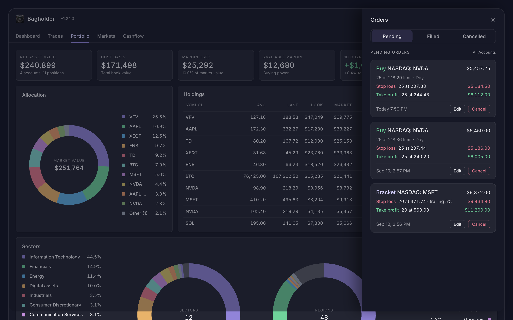
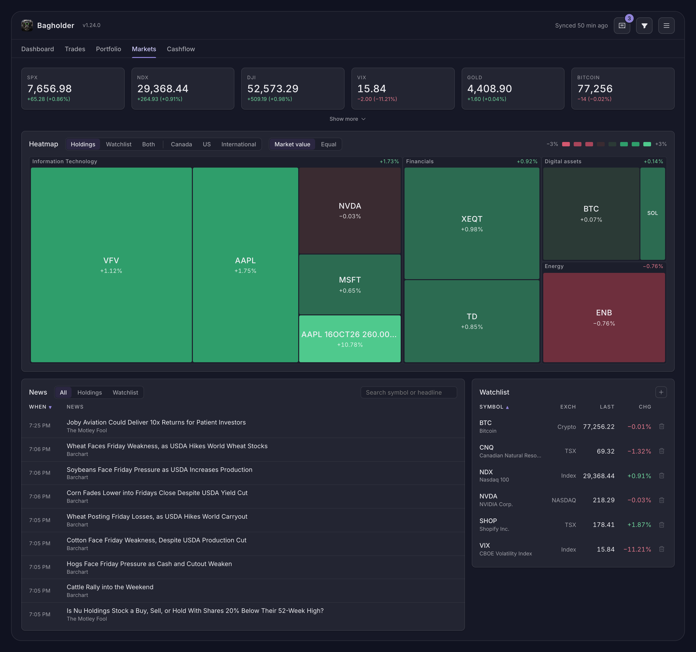

# Bagholder

A local-first trading journal for Wealthsimple users. It runs on your own computer, syncs your activity from Wealthsimple, and keeps everything in a local SQLite file. Nothing is uploaded anywhere.

## Disclaimer

**Use at your own risk.** Bagholder is an independent project. It is not affiliated with, endorsed by or supported by Wealthsimple.

- **Unofficial API.** Wealthsimple publishes no API for clients. Bagholder signs you in to the real Wealthsimple website with your own credentials and reads your accounts, positions and activity through the same private interface Wealthsimple's own web app uses. That interface is undocumented, can change or be withdrawn at any time, and Wealthsimple may treat automated access to it as a breach of its terms.
- **Your account, your terms.** It is your responsibility to read and understand Wealthsimple's Terms of Service and to decide whether using this app is compatible with them. Wealthsimple may restrict, suspend or close an account it finds in breach. If you are not prepared to put your account at that risk, do not use Bagholder.
- **Real orders, real money.** Orders placed from the app are placed at Wealthsimple in your account and are as real as any placed on Wealthsimple's site. Stops and targets the app manages are ordinary orders resting at Wealthsimple; the app can cancel, replace or fail to place them like any software can.
- **No warranty.** The software is provided as is, without warranty of any kind. Figures can be wrong, sources can change, and syncing can fail.
- **Sole responsibility.** You alone are responsible for your use of the app and for every outcome of it, including any loss, account restriction or closure, or other consequence. The author accepts no liability for any of them.



## Narrated tour

A minute and a half through every tab, with sound.

https://github.com/user-attachments/assets/7902d464-1cbc-4634-b21c-5f311263567b

## Screenshots



| Trades | A trade |
|---|---|
|  |  |
| **Portfolio** | **Cashflow** |
|  |  |
| **Order ticket** | **Orders** |
|  |  |



Also on iPhone and Android, as native apps written in Swift and Kotlin rather than a cross-platform framework, so they feel at home on each phone. They show the same figures as the desktop and keep everything on the device.

<table>
<tr>
<td></td>
<td></td>
<td></td>
<td></td>
</tr>
<tr>
<td></td>
<td></td>
<td></td>
<td></td>
</tr>
</table>

## What's supported

- Stocks and ETFs on Canadian and US exchanges, in CAD and USD
- Options, including covered calls, rolls, expiries and assignments
- Crypto, including staking rewards
- Dividends and distributions
- Any number of Wealthsimple accounts, self-directed or managed

Futures are not supported yet.

## Requirements

- Python 3.9 or newer
- A Chromium-based browser — Google Chrome, Brave, Microsoft Edge, or Chromium — opened once so you can sign in to Wealthsimple

## Install

```
python3 -m pip install -r requirements.txt
```

On Windows use `py` instead of `python3` throughout. The one dependency is `tzdata`, which Windows needs for time zones; macOS and Linux already have it.

## Run

```
python3 bagholder.py
```

The app opens at `http://127.0.0.1:8765` in your browser. Use that address as written; `localhost` is refused on purpose, since the server only answers its own machine.

## Docker

For a copy that runs in the background on a machine you keep on. Nothing is needed on the host but Docker: the image carries Chromium for the sign-in, and the database and the login live in `./data` beside the compose file.

```
docker compose up -d
```

Open `http://127.0.0.1:8765` and choose Connect Wealthsimple: the sign-in page opens inside the page. Sign in with your email, password and 2FA code (a passkey needs a real browser). The port is published on the host's loopback only. The image is published with every release; moving to a new one is under Keeping up to date below.

To build the image yourself instead, `docker build -t bagholder .` and point the compose file's `image` at `bagholder`.

## Keeping up to date

Every copy checks GitHub for the latest release when it starts and once an hour. When there is a newer one, the header shows it. Your database and your login are never part of an update; they stay in `~/.bagholder`.

- **Unpacked from a release archive:** the header shows an `Update to vX.Y.Z` button. Press it. Bagholder downloads the release, checks it against the release's checksum, swaps its own files and restarts itself; the copies it replaced are kept under `~/.bagholder/previous` until the next update.
- **Cloned with git:** the same button runs `git pull` on `master` and restarts. A checkout with local changes or on another branch gets an `Update available` link instead, and you pull it yourself:

  ```
  git pull
  ```

  then start `python3 bagholder.py` again.
- **Docker:** the container has no update button. The header shows `vX.Y.Z image available` with a link to the release, and the update is the pull above:

  ```
  docker compose pull && docker compose up -d
  ```

## First use

Connect Wealthsimple and sign in. Bagholder pulls your full history, then syncs every weekday after the close while it is running.

Trades can also be imported from Wealthsimple's CSV exports, or entered by hand.

## What it shows

- **Dashboard**: realized P&L, win rate, profit factor, expectancy, max drawdown net of deposits and withdrawals, annualized returns vs the S&P 500 or the S&P/TSX Composite, equity curve, monthly P&L, P&L by grade, P&L by symbol, and a review queue of ungraded trades.
- **Trades**: every closed trade with its executions, a price path across the fills, and a journal with a thesis, a grade and tags. Shares, options and crypto are all matched FIFO per account; covered calls, rolls, expiries and assignments are handled.
- **Portfolio**: market value, net asset value, cost basis, margin used, available margin and unrealized P&L across the accounts you choose; allocation; sector and region exposure, every ETF looked through to its holdings from the issuer's own record; every open holding with the day's change, each opening on its own page with the chart, the fills and the journal that becomes the trade's when it closes.
- **Markets**: a sector heatmap of your holdings, your watchlist, the S&P/TSX 60, the hundred largest US companies or the largest foreign companies listed in the US, sized by value and coloured by the day's change; a watchlist of listings, indices, futures, rates and currency pairs with live prices and day changes, added from the same search as everything else; and the news on every symbol you hold or watch, from TMX Money and Nasdaq, searchable and scoped to a symbol with a click.
- **Cashflow**: distributions by month and by holding, with yield on cost and current yield from each fund's declared distributions.
- **Orders**: an order ticket for shares and ETFs, opened from any symbol in the search list, the book's own or one found by typing (the search asks the exchanges' directories, never Wealthsimple), with a stop loss and a take profit alongside. After a buy fills, the stop loss goes to Wealthsimple as its own stop order, good till cancelled and placed again before Wealthsimple's ninety days end; the take profit is watched and placed as a limit sell when the price reaches it, with the stop level still watched meanwhile. Wealthsimple holds one order on a position's shares at a time, and Bagholder manages that single order so nothing of a bracket's ever outlives the position. An Orders panel from the header lists every order placed here or pending at Wealthsimple with its status read back, its brackets and their state, and lets you adjust a bracket, edit or cancel an open order.

A filter icon next to the menu narrows every page at once by date, account, symbol, grade, tag, side, kind, exchange, price, hold time, P&L or quantity.

Per-trade figures are in the trade's currency. Anything that adds trades together is in CAD, converted on the fill dates.

## Data

Everything lives in `~/.bagholder/` (`%USERPROFILE%\.bagholder` on Windows): the database `bagholder.db` and the Wealthsimple session. Back up by copying the folder. **Clear data** in the menu deletes the data and keeps the login; **Disconnect** removes the login and keeps the data.

Market data the app needs but Wealthsimple does not provide is fetched over HTTPS and cached in the same database: USD/CAD rates from the Bank of Canada, S&P 500 closes from FRED, S&P/TSX Composite closes from TMX Money, prices and declared distributions from TMX Money, Cboe Canada prices from cboe.com, crypto prices from Coinbase, US option prices from Cboe's delayed chains, and daily price history for the trade chart from TMX Money, Cboe Canada and CoinGecko. The trade chart is drawn with TradingView's open-source Lightweight Charts, bundled with the app.
