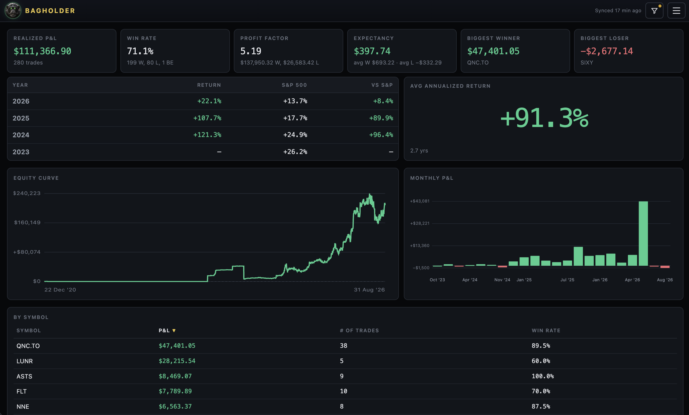
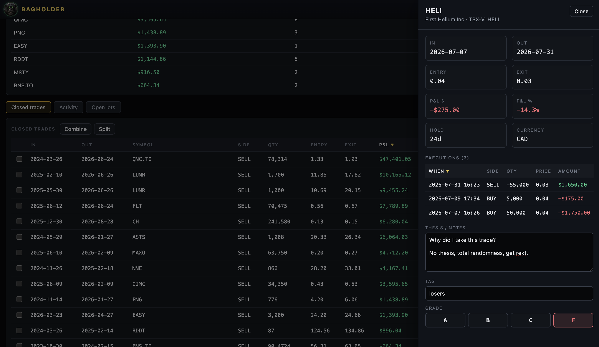
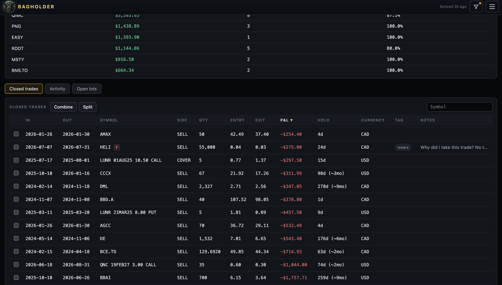
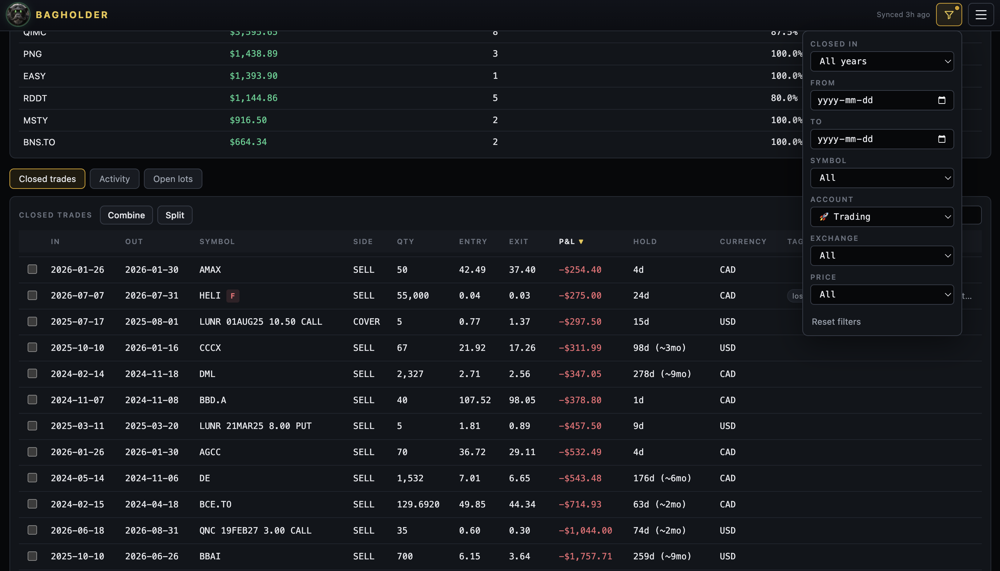

# Bagholder

A local-first trading journal for Wealthsimple users. Runs on your computer, auto-syncs trades from Wealthsimple. Activity stays on your machine.

Provides a dashboard with total realized P&L, win rate/profit factor, expectancy, biggest winners/losers, annualized performance vs S&P500, equity curve, monthly P&L with some basic sorting/filtering.

Use at your own risk. The app will have you log into the actual Wealthsimple website in order to sync. I am not responsible for your use or misuse of the app or any consequences thereof.

## Run

This installs timezone data Windows does not ship (needed for America/Edmonton).

```
python -m pip install -r requirements.txt
```

```
python3 bagholder.py
```

The webapp opens on `http://127.0.0.1:8765`.

## Data

Login session and journal data are stored in `~/.bagholder/`. Activities, accounts, balances, and equity history live in `~/.bagholder/bagholder.db`.




